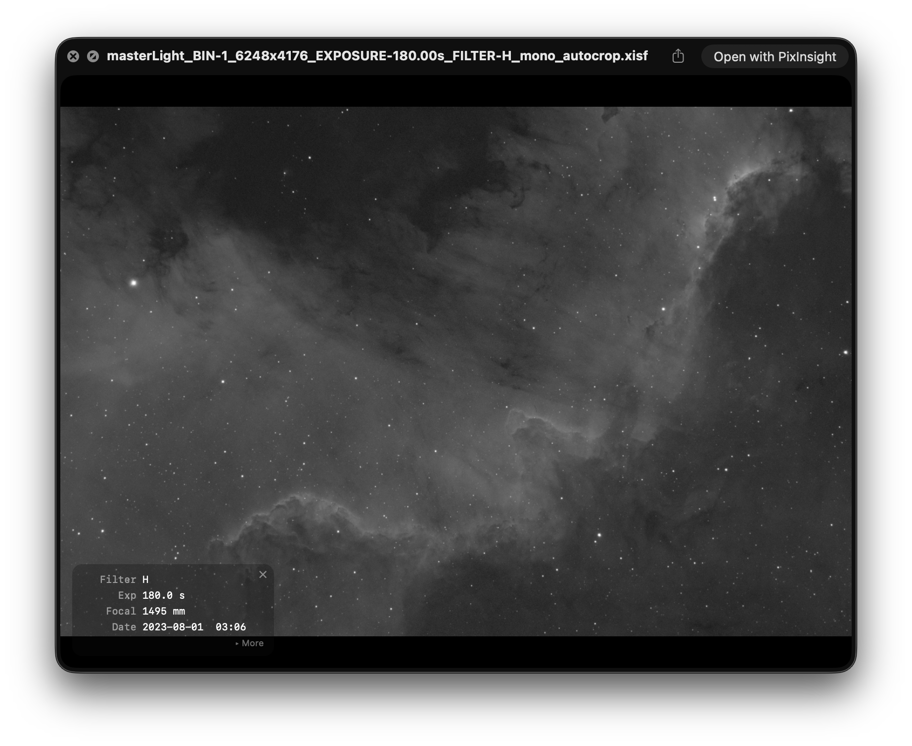

# XISFQuickLook

macOS Quick Look plugin for astronomical image files — Finder thumbnails and full previews for **XISF** (PixInsight) and **FITS** files, with no extra application required.



## Features

- **Finder thumbnails** for `.xisf`, `.fits`, `.fit`, and `.fts` files
- **Full Quick Look preview** (Space bar) with smooth pan and pinch-to-zoom
- **Auto-stretch** using PixInsight's Screen Transfer Function (STF) so raw linear data looks great without any processing
- **Metadata overlay** — filter, exposure, focal length, sensor temperature, and date/time, visible at a glance
- Tap the overlay to expand for full details: object, camera, scope, gain, binning, image size
- Dismiss the overlay with ✕; click the image to bring it back
- Supports grayscale and RGB, all standard FITS `BITPIX` types (8, 16, 32, −32, −64), and XISF with embedded thumbnails

## Requirements

- macOS 13.3 Ventura or later
- Apple Silicon or Intel

## Installation

1. Download **XISFQuickLook.dmg** from [Releases](../../releases/latest)
2. Open the DMG and drag **XISFQuickLook.app** into Applications
3. Launch the app once — it registers the Quick Look extensions automatically
4. Press Space on any `.xisf` or `.fits` file in Finder

> **Gatekeeper note:** Because releases are ad-hoc signed (not notarized), macOS may block the app on first open. Right-click → **Open**, then confirm. Or remove the quarantine attribute:
> ```sh
> xattr -dr com.apple.quarantine /Applications/XISFQuickLook.app
> ```

## Building from Source

### Prerequisites

```sh
brew install xcodegen cmake zstd
```

Xcode 16 or later is required.

### Build and install

```sh
git clone https://github.com/getsaf/xisf-quick-look.git
cd xisf-quick-look
make install
```

`make install` builds libxisf, generates the Xcode project, compiles the app, copies it to `/Applications`, and resets the Quick Look daemon. After a few seconds `.xisf` and `.fits` files will show thumbnails and previews in Finder.

### Makefile targets

| Target | Description |
|---|---|
| `make deps` | Build the vendored libxisf static library |
| `make project` | (Re-)generate the Xcode project via xcodegen |
| `make build` | Build the app |
| `make install` | Build + copy to /Applications + restart Quick Look |
| `make reset-ql` | Restart the Quick Look daemon and Finder |
| `make clean` | Remove build artifacts and generated project |

## How it works

The plugin ships two Quick Look extensions inside a lightweight host app:

| Extension | Role |
|---|---|
| `XISFThumbnail.appex` | Generates Finder icon thumbnails |
| `XISFPreview.appex` | Renders the full Quick Look preview panel |

Both extensions share a common bridge (`XISFBridge`, Objective-C++) that:

1. **XISF**: reads files via the vendored [libxisf](https://gitlab.com/NoobsEnslaved/libxisf); uses the embedded display thumbnail when present, otherwise decodes the full image
2. **FITS**: reads files with a built-in minimal FITS parser — no external dependency; handles all uncompressed `BITPIX` types with `BSCALE`/`BZERO` scaling
3. Applies a PixInsight-compatible STF auto-stretch to make linear data visually useful
4. Extracts FITS header keywords for the metadata overlay

## Third-party libraries

| Library | License | Use |
|---|---|---|
| [libxisf](https://gitlab.com/NoobsEnslaved/libxisf) | LGPL-3.0 | XISF format support |
| [lz4](https://github.com/lz4/lz4) | BSD 2-Clause | Bundled with libxisf |
| [pugixml](https://pugixml.org) | MIT | Bundled with libxisf |
| [zlib](https://zlib.net) | zlib | Bundled with libxisf |

## License

MIT — see [LICENSE](LICENSE)
